<!-- .slide: class="slide-title" -->

# [Santiago Soler](https://www.santisoler.com)

[*Geophysical Inversion Facility*](https://gif.eos.ubc.ca/)
 
[*Earth, Ocean and Atmospheric Sciences*](https://www.eoas.ubc.ca/)
 
[*University of British Columbia*](https://www.ubc.ca/)

---

# Background

* Licenciate in Physics (UNR, Argentina)
* PhD in Geophysics (CONICET & UNSJ, Argentina)
* Postdoc Researcher at [UBC](https://www.ubc.ca)
* Former member of the
  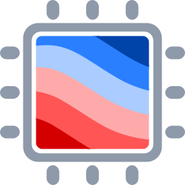
  [Computer-Oriented Geoscience Lab](https://www.compgeolab.org)
* Core developer of
  
  [Fatiando a Terra](https://www.fatiando.org)

---

<!-- .slide: class="slide-transition" data-background-color="#de6f2e" -->

# Past research

---

# Gravitational fields in   spherical coordinates

---

### Tesseroids

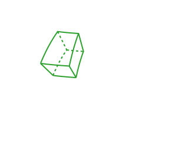

a.k.a. spherical prisms

Tesseroids' gravitational fields:

$$
    V(\mathbf{p}) = G \rho
        \iiint_V
        \frac{\kappa}{\left\lVert \mathbf{p} - \mathbf{q} \right\rVert}
        \text{d} r' \text{d} \lambda' \text{d} \phi'
$$

**no analytical solution**

---

### Tesseroids

a.k.a. spherical prisms

**Solution:**
 
Numerical approximations

$$
    V(\mathbf{p}) \cong
        G \rho
        A
        \sum\limits_{i=1}^{N_r}
        \sum\limits_{j=1}^{N_\lambda}
        \sum\limits_{k=1}^{N_\phi}
        W_{ijk}
        \frac{\kappa_{ik}}{\left\lVert \mathbf{p} - \mathbf{q}_{ijk} \right\rVert}
$$

---

## Constant density tesseroids

$$
    V(\mathbf{p}) = G {\color{#e4564a}{\rho}}
        \iiint_V
        \frac{\kappa}{\left\lVert \mathbf{p} - \mathbf{q} \right\rVert}
        \text{d} r' \text{d} \lambda' \text{d} \phi'
$$

---

## Variable density tesseroids

$$
    V(\mathbf{p}) = G
        \iiint_V
        {\color{#e4564a}{\rho(r')}}
        \frac{\kappa}{\left\lVert \mathbf{p} - \mathbf{q} \right\rVert}
        \text{d} r' \text{d} \lambda' \text{d} \phi'
$$

---

<!-- .slide: data-auto-animate -->

## Developed new method

- **Gravitational fields** of **variable density tesseroids**
- **Density**: continuous **function of depth**
- Open-source **Python** implementation

---

<!-- .slide: data-auto-animate -->

## Developed new method

- **Gravitational fields** of **variable density tesseroids**
- **Density**: continuous **function of depth**
- Open-source **Python** implementation

<pre style="width: 60vw; min-width: 40em;"><code data-line-numbers="*|4-7|9-11" data-trim data-noescape class="python hljs">
from numba import njit
import harmonica as hm

@njit
def linear_density(radius):
    origin, slope = ...
    return slope * radius  + origin

gravity = hm.tesseroid_gravity(
    coordinates, tesseroids, linear_density, field="g_z"
)
</code></pre>

---

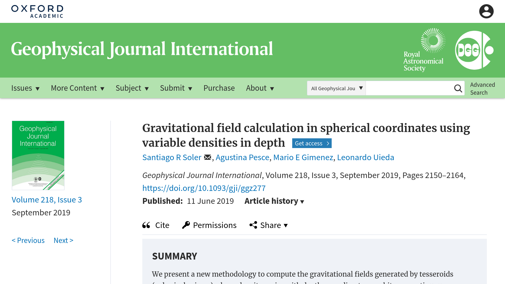

Soler et al. (2019). doi: [10.1093/gji/ggz277](https://doi.org/10.1093/gji/ggz277)

Preprint: [10.31223/osf.io/3548g](https://doi.org/10.31223/osf.io/3548g)

---

# Gradient-boosted equivalent sources

---

<!-- .slide: data-background-color="#eee" data-auto-animate -->

## Equivalent sources

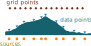

---

<!-- .slide: data-background-color="#eee" data-auto-animate -->

## Equivalent sources

- Always produce **harmonic fields**
- Consider the **observation heights**

---

## THE PROBLEM

### Require too much computational load

- 200.000 data points
- \+ 200.000 equivalent sources
- = **~300GB RAM**

---

<!-- .slide: data-auto-animate -->

## THE SOLUTION

### Gradient-boosted equivalent sources

- Interpolate **very large datasets**
- Significant **reduction** in required **memory**
- Open-source **Python** implementation

---

<!-- .slide: data-auto-animate -->

## THE SOLUTION

### Gradient-boosted equivalent sources

- Interpolate **very large datasets**
- Significant **reduction** in required **memory**
- Open-source **Python** implementation

<pre style="height: 15em; width: 60vw; min-width: 40em;"><code data-line-numbers="*|4-6|7|9-12" data-trim data-noescape class="python hljs">
import verde as vd
import harmonica as hm

eqs = hm.EquivalentSourcesGB(
    depth=depth, damping=damping, window_size=window_size
)
eqs.fit(coordinates, data)

grid_coords = vd.grid_coordinates(
    region, spacing, extra_coords=height
)
grid = eqs.grid(grid_coords)
</code></pre>

---

## Gridding +1.7 million gravity data points

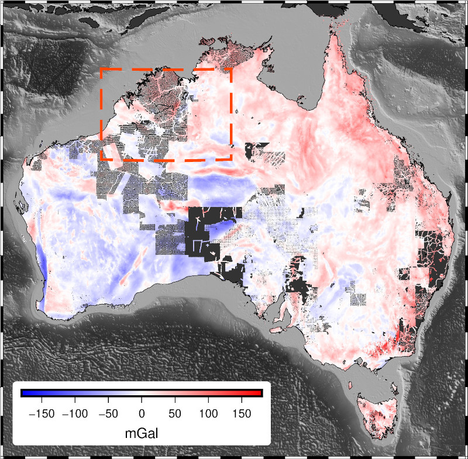

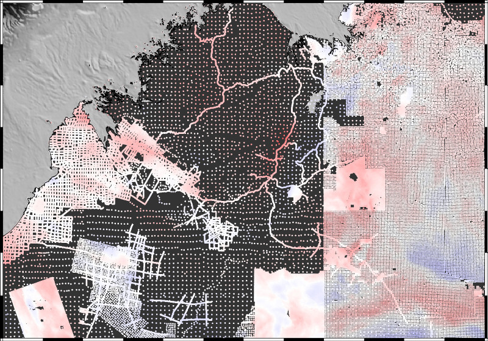

---

## Gridding +1.7 million gravity data points

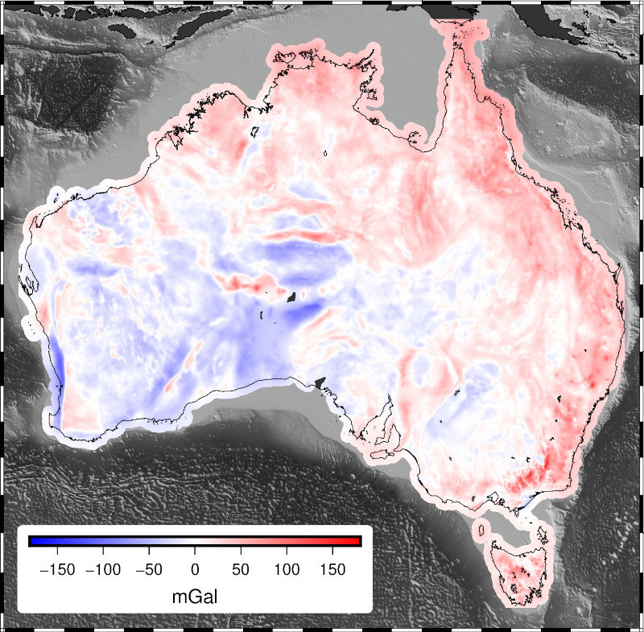

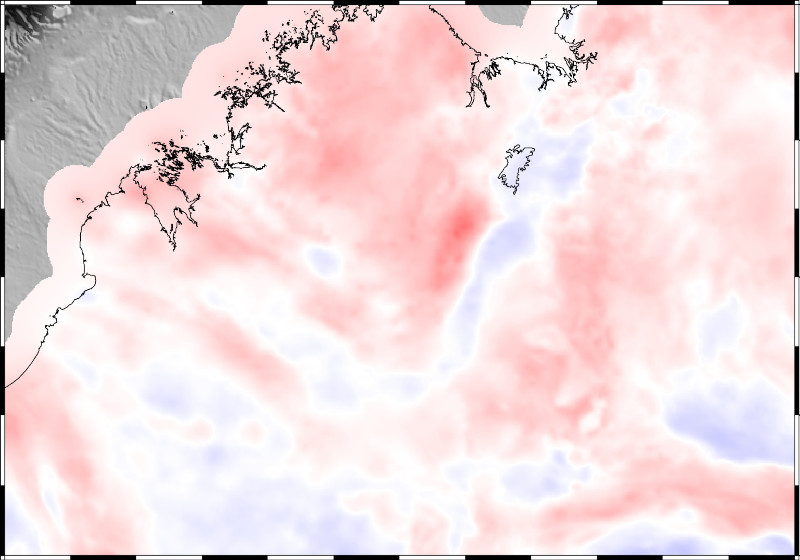

---

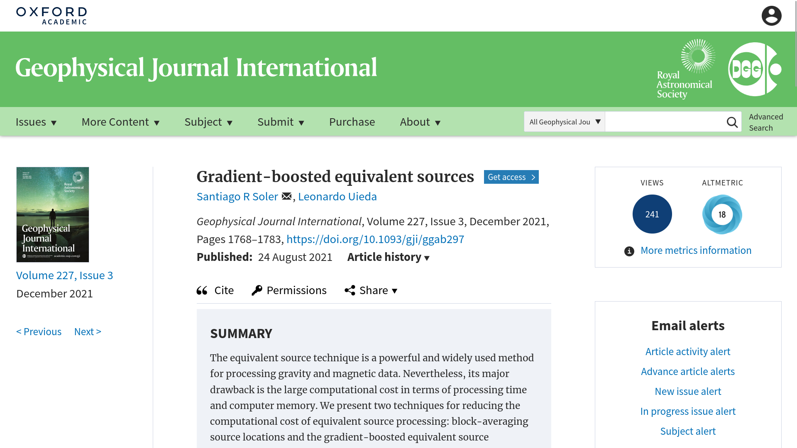

Soler and Uieda (2021). doi: [10.1093/gji/ggab297](https://doi.org/10.1093/gji/ggab297)

Preprint: [10.31223/X58G7C](https://doi.org/10.31223/X58G7C)

---

<!-- .slide: class="slide-transition" data-background-color="#de6f2e" -->

# Open-source software development

---

<!-- .slide: data-background-color="#060629" data-background-image="images/fatiando-website.png" data-background-size="contain" -->

[www.fatiando.org](https://www.fatiando.org)

---

<!-- .slide: data-auto-animate -->

## The libraries

---

<!-- .slide: class="slide-fatiando-libraries" data-auto-animate -->

<!-- ========= -->
<!-- First row -->
<!-- ========= -->

<!-- Verde -->

<h1 style="display: flex; align-items: center; justify-content: center;">
  
  Verde
</h1>

**Spatial** data processing and **interpolation**
with a **Machine Learning** flavour

<ul class="fa-ul">
<li><i class="fa-li fas fa-book fa-fw" title="Verde docs"></i>
   <a href="https://www.fatiando.org/verde">fatiando.org/verde</a>
</li>
<li><i class="fa-li fab fa-github fa-fw" title="Github repository"></i>
   <a href="https://github.com/fatiando/verde">fatiando/verde</a>
</li>
</ul>

<!-- Boule -->

<h1 style="display: flex; align-items: center; justify-content: center;">
  
  Boule
</h1>

**Reference ellipsoids** and **normal gravity** calculations

<ul class="fa-ul">
<li><i class="fa-li fas fa-book fa-fw" title="Verde docs"></i>
   <a href="https://www.fatiando.org/boule">fatiando.org/boule</a>
</li>
<li><i class="fa-li fab fa-github fa-fw" title="Github repository"></i>
   <a href="https://github.com/fatiando/boule">fatiando/boule</a>
</li>
</ul>

 <!-- container div -->

<!-- ========== -->
<!-- Second row -->
<!-- ========== -->

<!-- Harmonica -->

<h1 style="display: flex; align-items: center; justify-content: center;">
  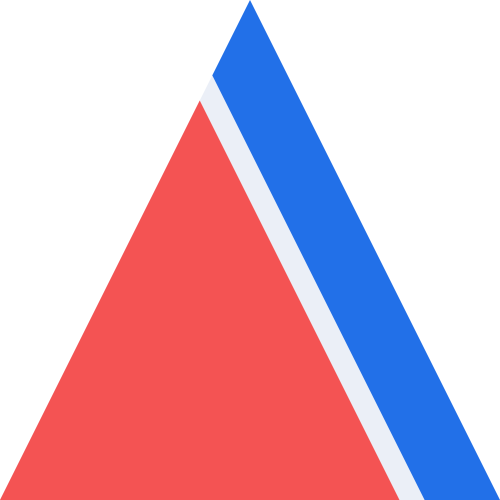
  Harmonica
</h1>

**Processing** and **modelling potential fields** data

<ul class="fa-ul">
<li><i class="fa-li fas fa-book fa-fw" title="Verde docs"></i>
   <a href="https://www.fatiando.org/harmonica">fatiando.org/harmonica</a>
</li>
<li><i class="fa-li fab fa-github fa-fw" title="Github repository"></i>
   <a href="https://github.com/fatiando/harmonica">fatiando/harmonica</a>
</li>
</ul>

<!-- Pooch -->

<h1 style="display: flex; align-items: center; justify-content: center;">
  
  Pooch
</h1>

A friend to **download** and **cache** your data

<ul class="fa-ul">
<li><i class="fa-li fas fa-book fa-fw" title="Verde docs"></i>
   <a href="https://www.fatiando.org/pooch">fatiando.org/pooch</a>
</li>
<li><i class="fa-li fab fa-github fa-fw" title="Github repository"></i>
   <a href="https://github.com/fatiando/pooch">fatiando/pooch</a>
</li>
</ul>

 <!-- container div -->

---

# Who we are

<a href="https://www.leouieda.com">Leonardo Uieda</a>

<a href="https://www.santisoler.com">Santiago Soler</a>

---

# Who is using Fatiando?

---

<!-- .slide: data-background-image="images/fatiando-papers.png" data-background-size="contain" data-background-repeat="no-repeat" -->

---

<!-- .slide: data-background-color="#eee" -->

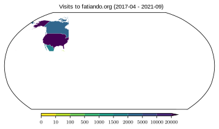

---

<!-- .slide: data-background-color="#eee" -->

# Research and open-source software

---

<!-- .slide: data-background-color="#eee" -->

# Research and open-source software

---

<!-- .slide: data-background-color="#eee" -->

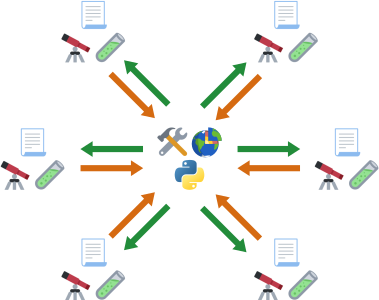

---

<!-- .slide: class="slide-transition" data-background-color="#de6f2e" -->

# Current research

---

<!-- .slide: data-background-color="#eee" -->

## Carbon mineralization

Serpentinization

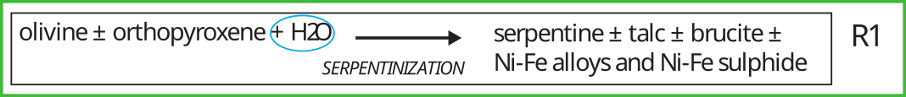

Carbonation

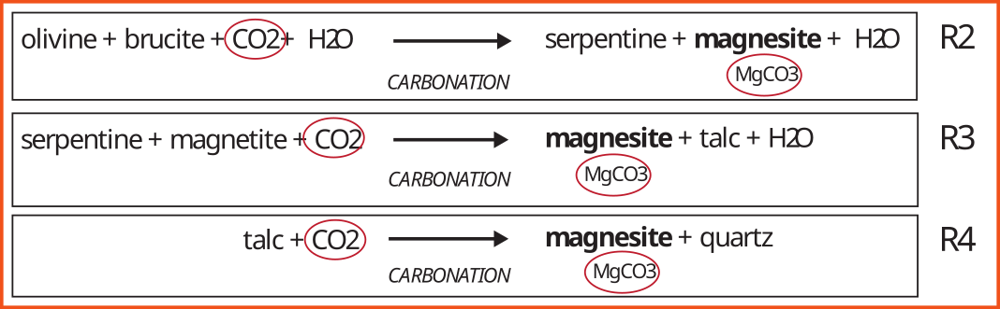

- **Serpentinized** rocks react with **CO2**
- Mineralize in **carbonated** rocks
- **Carbon sequestration** with **ultramafic rocks**

Cutts et al. (2021). doi: [10.1029/2021GC009989](https://doi.org/10.1029/2021GC009989)

Mitchinson et al., (2020). ISBN: 978-0-88865-470-0

---

## Physical properties

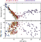

**Density** and **susceptibility** change with alteration

---

## *Research opportunity:*

## Geophysical inversion for assessing   carbonation potential

---

## Goals

- **Gravity** + **magnetic** data
- 3D joint **inversions**
- Characterize **volume** and **depth** of rocks with **carbonation potential**

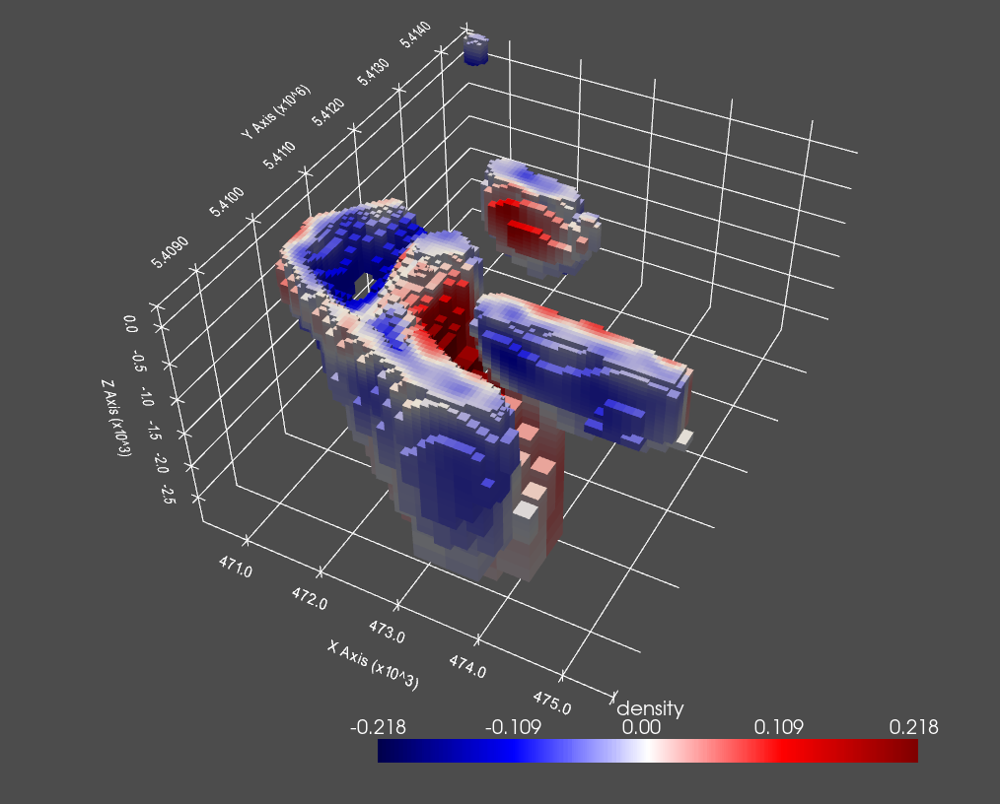

---

# Contact

<ul class="fa-ul">
<li><i class="fa-li fa fa-envelope"></i>

[ssoler@eoas.ubc.ca](mailto:ssoler@eoas.ubc.ca)

</li>
<li><i class="fa-li fa fa-globe-americas"></i>

[www.santisoler.com](https://www.santisoler.com)

</li>
<li><i class="fa-li fab fa-github"></i>

[@santisoler](https://www.github.com/santisoler)

</li>
<li><i class="fa-li fab fa-mastodon"></i>

[@santisoler@scicomm.xyz](https://scicomm.xyz/santisoler)

</li>
</ul>

---

<!-- .slide: class="slide-license" -->

<h1 style="margin: 1em 0;"> Muchas gracias | Thank you </h1>

**Slides:** [www.santisoler.com/2022-ubc-open-house](https://www.santisoler.com/2022-ubc-open-house)

<i class="fab fa-creative-commons"></i><i class="fab fa-creative-commons-by"></i>

These slides are available under a  
[Creative Commons Attribution 4.0 International License](https://creativecommons.org/licenses/by/4.0/)
